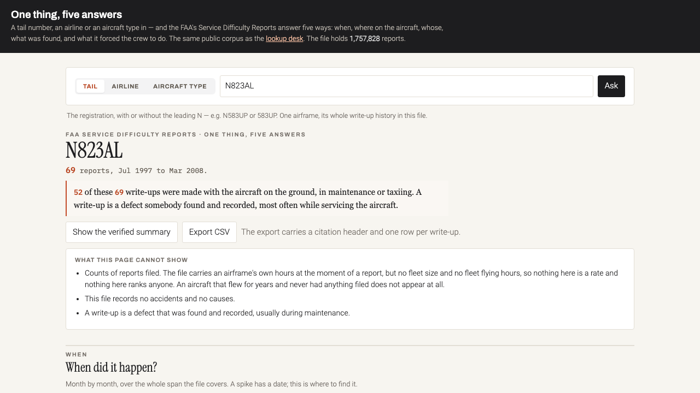
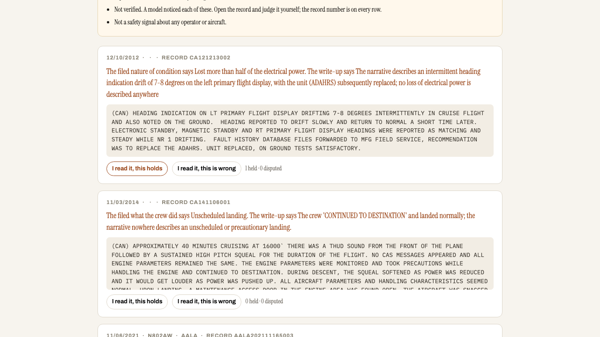

# Make it readable

[](https://docs.z.ai/guides/vlm/glm-5.3-flash)
[](https://aircraftdefects.com/z/)
[](https://aircraftdefects.com)
[](LICENSE)
[](https://cerebralvalley.ai/e/glm-5-3-flash-lightning-hackathon)

**A government can publish everything it holds and still answer none of your questions.**

I was watching *Freefall* on Netflix. Relatives of victims were trying to find
answers about aircraft defects on a government website. Row after row of capital
letters. Zone numbers. Single-character codes.

I stopped the documentary, typed the URL in myself, and never went back to it.

What I found was a public database nobody could use. Not secret. Not redacted.
1,757,828 reports going back to 1995, on 54,634 aircraft, every one of them free
to read, and almost none of them ever read. A report says `ZONE 700` where it
means the landing gear, and `A` where it means the crew landed somewhere they had
not planned to. Trying a real query, I hit timeouts and lags: the ordinary
complaints of software left alone for a long time.

It irritated me that all of that was there and none of it was reachable.

*This repository is the second pass. The first made the database searchable. This
one asks a different question, and the features in it were not specified by a
human: GLM-5.3-Flash was given flat source material and asked what should be
built. Every turn of that session is committed here, reasoning traces included:
198,227 tokens through the model, 314,399 characters of its thinking kept, so the
claim can be checked rather than believed.*





**Try it:** [aircraftdefects.com/z](https://aircraftdefects.com/z/) ·
**The ledger:** [/z/conflicts](https://aircraftdefects.com/z/conflicts) ·
**Parent tool:** [aircraftdefects.com](https://aircraftdefects.com)

---

## The Problem

The questions I wanted answered were not exotic. What was reported yesterday.
Which company reported the most. When did it happen, who was involved, where on
the aircraft, what kind of defect, and what did it force the crew to do.

Without the when, the what, the where and the who, you never get to why. And why
is where the story is: why does one operator send the same aircraft in sixty times
in a year?

None of that was reachable, and the reason is small and stupid. The FAA publishes
the database and it publishes the dictionary. It has never put the two on the same
page.

A Service Difficulty Report has ten boxes and nine of them are codes. The airline
is four letters. What the mechanic found is a code. How they found it is another
code. What it forced the crew to do is a third. Every one resolves against a table
the FAA publishes as a zip file on the same website, twenty seconds away, which no
ordinary person will ever open.

Nothing is secret. Nothing is redacted. The record and its own dictionary were
published by the same agency and never introduced to each other.

| On the form | What it actually says |
|---|---|
| `CALA` | Continental Airlines Inc |
| `2530` | Buffet and galleys |
| `IN` | On the ground, in inspection or maintenance |
| `V` | Visual. Someone looked at it |
| `B` | Smoke, fumes, odour or sparks |
| `33` | not in any FAA table, so it stays `33` |

Read as English: a Continental aircraft had smoke or sparks from the galley, found
by eye during ground maintenance, no emergency procedure triggered.

---

## What This Does

The parent tool answers *which reports match these filters*. That is a lookup. This
answers a question about a thing, in the order a reporter actually asks:

| | | |
|---|---|---|
| **WHEN** | month by month, over the whole span | a spike has a date |
| **WHERE** | on the airframe, zone and system | drawn on an aircraft |
| **WHO** | which airline, which tail, which type | click any of them to become the subject |
| **WHAT** | what was found | nature, part, condition |
| **WHAT IT FORCED** | what the defect made the crew do | the question the FAA buries hardest |

One thing in: a tail number, an airline, or an aircraft type. Five answers out.

### The Flip

**What the form says:**

> `PrecautionaryProcedureA: E` · `StageOfOperationCode: IN`

**What the same mechanic wrote underneath:**

> THE AIRCRAFT WAS ON THE GROUND DURING BOARDING, JET BRIDGE PULLED AWAY, AND THE
> APU AUTO-SHUTDOWN BEFORE THE CREW COULD MANUALLY SHUT IT DOWN

`E` decodes to **Engine shut down in flight**. The aircraft was on the ground. It
was the APU. Not an engine, not in flight.

That is record `AALA202111165003`, and it is in the ledger.

### Say this in plain English

The one generated surface. The model rephrases the mechanic's write-up, keeping
every step in order, and it may refuse. It sits **under** the original, never
instead of it.

It also returns two things nobody asked for:

**An abbreviation table**, marked by source. `AGL` is derivable from the text, so
it is marked *from the record*. That `GEG` is Spokane comes from the model's own
knowledge, so it is marked *not in this record* and you are told to check it.

**A code disagreement notice**, when the ticked box contradicts the paragraph.

---

## Conflicting Reports: a ledger, not a rate

Two attempts to measure how often codes disagree with their own narrative both
failed, and [the failures are written up rather than buried](docs/FINDINGS.md).
A first pass said 14.5%. An adversarial check cut it to 2.0%. Then the check
turned out to have an adjudicator that refuted every flag it ever saw, which makes
it a constant rather than a judge.

So the tool stopped trying to produce a rate. A rate needs a denominator, a
denominator needs a calibrated instrument, and there is not one. A ledger needs
neither.

[**/z/conflicts**](https://aircraftdefects.com/z/conflicts) fills up from ordinary
use. Somebody opens a report, presses *Say this in plain English*, and if the model
notices the disagreement the case is written down with its record number. Nothing
sweeps the file, so the ledger's size measures **attention, not prevalence**, and
the page says that in its first paragraph.

Every row has two buttons, *this holds* and *this is wrong*, and both are counted.
A row where a human overrules the model is the row worth studying.

---

## The Method: the model designs, and we keep the receipts

Nobody wrote a long prompt. The technique is the **Prewash**, documented in
[PREWASH_METHOD.md](PREWASH_METHOD.md).

| | What happens | Artefact |
|---|---|---|
| **1** | A human types one short line asking for a *prompt*, alongside source material stripped of adjectives | [`design/01`](design/01-prompt-the-model-wrote.md) |
| **2** | The human reads what the model wrote, then types `execute prompt` | [`design/02`](design/02-answer.md) |
| **3** | The human makes it mark every sentence as stated or inferred | [`design/03`](design/03-stated-vs-inferred.md) |

The entire human input to step 1 was one sentence:

> Give me a prompt to work out what to build on this dataset for these users.

**Why not simply write the prompt.** A detailed prompt carries its author's
assumptions in its adjectives. Ask a model to find the most alarming safety
patterns and it will find alarm, because that is the question it was handed. The
answer will look like analysis and be a reflection.

### What that produced

Told nothing about pitfalls, from counts and column names alone, the model
identified the three traps in this dataset and built its prompt around them:
missing denominators, missing causes, and a grieving non-expert audience.

It **corrected the source material**. The brief placed a 1M-token context window
next to a 1.76M-record dataset. It caught the implication and made batched
pipelines a precondition rather than a later discovery.

It **refused the decision that was not its to make**, on whether relatives of
victims should see a per-tail history:

> it's the highest-stakes design decision in the whole plan and it shouldn't be
> left to the model.

That decision, and who made it, is in [docs/DECISIONS.md](docs/DECISIONS.md).

And in step 3 it **caught itself inventing a statistic** that one of its own
recommended builds rested on. The database then disproved it. See
[F2 in FINDINGS.md](docs/FINDINGS.md).

### It read the parent tool's source

The page was not written from a description of the house style. GLM-5.3-Flash was
given **85,326 tokens of the real thing**: the parent Flask app, its 219KB
single-page front end, and this backend. Fourteen minutes later it returned a
complete page that matched the palette, the fonts and the restraint, including
external font loads and a link I wrongly flagged as invented and which turned out
to be copied faithfully from the original.

That is what a 1M context window is for.

---

## How the model is used

| Setting | Value | Why |
|---|---|---|
| Model | `glm-5.3-flash` | the only member of the GLM-5 series that accepts images; GLM-5.3 is text only |
| Reasoning | `max` designing, `high` on long narratives, `low` on short ones | reasoning cannot be disabled and defaults to `max`; paying a deep-reasoning model to transcribe ten boxes is money burned |
| `clear_thinking` | `false` | vendor recommendation, and it is what makes the sessions auditable |
| `temperature` / `top_p` | 1 / 0.95 | vendor recommendation for this model |
| Structured output | JSON, with an abstain field | so it cannot ramble into a field that renders as fact |

Reasoning effort is a declared choice per task, never disabled.

---

## The rule the whole thing rests on

**The model reads. The tables decide.**

It is never asked what a code means. Meaning comes from the FAA's own published
tables, applied in code. A code absent from those tables renders as the raw code,
in red, labelled undecoded.

Asked to interpret, any model produces a plausible expansion for a code it has
never seen and does not flag the guess. On a public safety record that is a
fabricated fact wearing the formatting of a real one, and a reporter cannot tell
the difference.

## What this will never claim

- Not an accident database, and not a safety ranking.
- No league table of operators. The file carries an airframe's own hours but no
  fleet flying hours, and the only aircraft with hours in it are the ones that had
  something filed. A denominator built from this file would be built out of its own
  numerator.
- No causal language. The file does not record the cause of a defect.
- A write-up is a defect that maintenance **caught**. 74% of all reports were
  written with the aircraft on the ground. That is usually the system working.
- Every number traces to records the reader can open.

---

## Repository

| | |
|---|---|
| [PREWASH_METHOD.md](PREWASH_METHOD.md) | the technique, and why writing your own prompt defeats it |
| [HACKATHON_LOG.md](HACKATHON_LOG.md) | every step in order, including what went wrong |
| [docs/FINDINGS.md](docs/FINDINGS.md) | four findings about the data, one of them a retraction |
| [docs/DECISIONS.md](docs/DECISIONS.md) | what a model does not get to decide |
| [design/](design/) | the design session, verbatim, with reasoning traces |
| [build/](build/) | the build session, the measurement, the failed calibration |
| [app/](app/) | the service running at /z |

## Running it

```bash
python3 -m venv .venv && ./.venv/bin/pip install flask requests python-dotenv
echo "ZAI_API_KEY=your-key" > .env
./.venv/bin/python app/app.py     # 127.0.0.1:8211
```

Reproduce the design session with `./.venv/bin/python design/ask_glm.py`, the
measurement with `build/measure_tension.py`, and its calibration with
`build/validate.py`. The samples are seeded, so the same records come back.

MIT.
