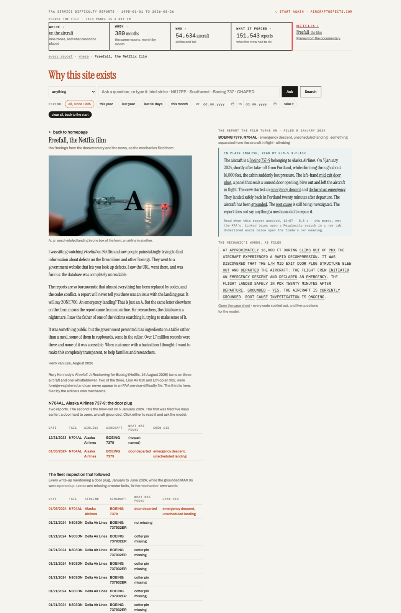
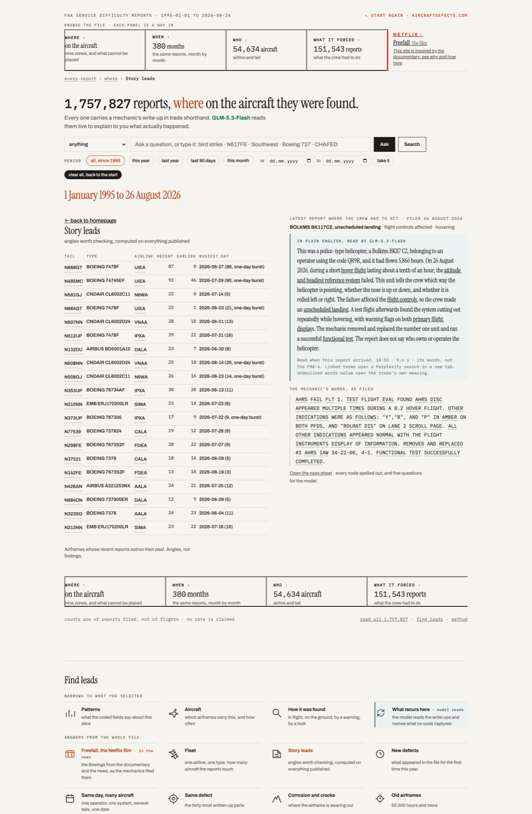
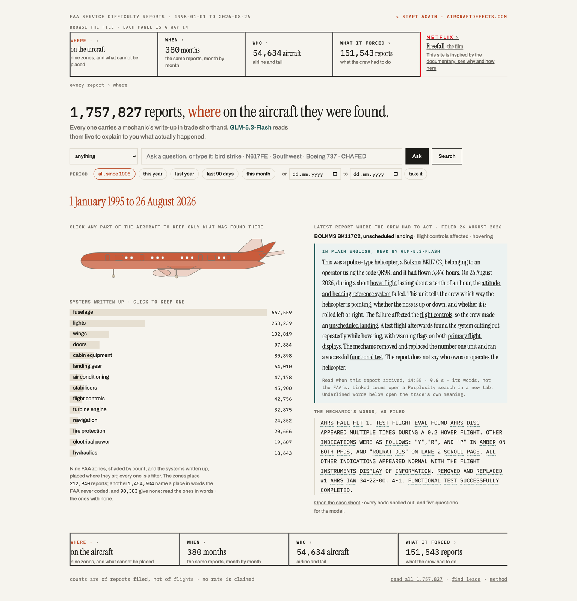
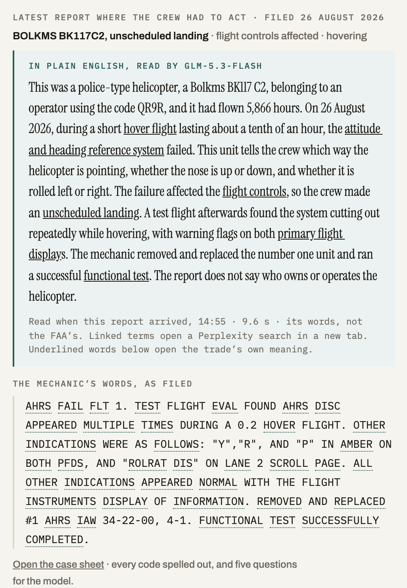
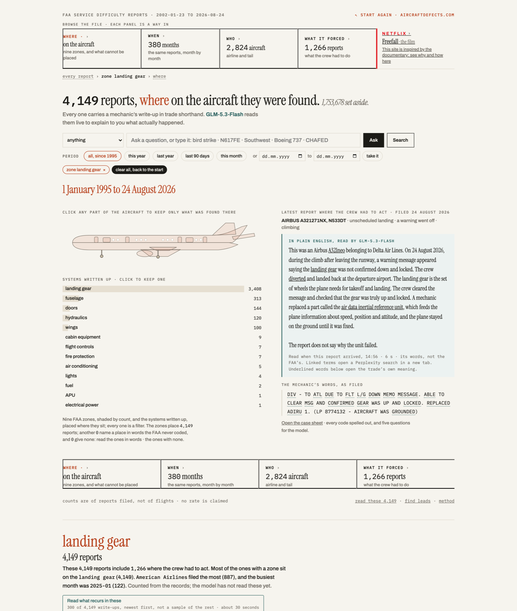
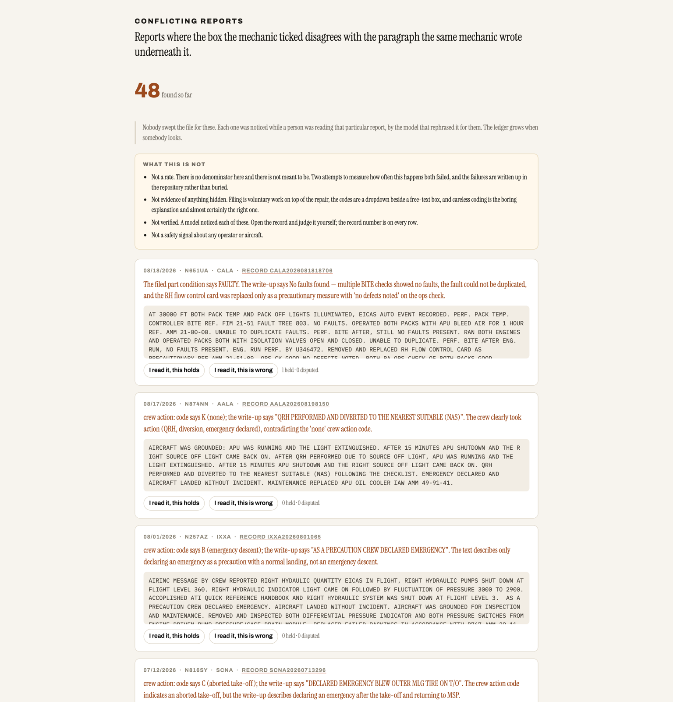
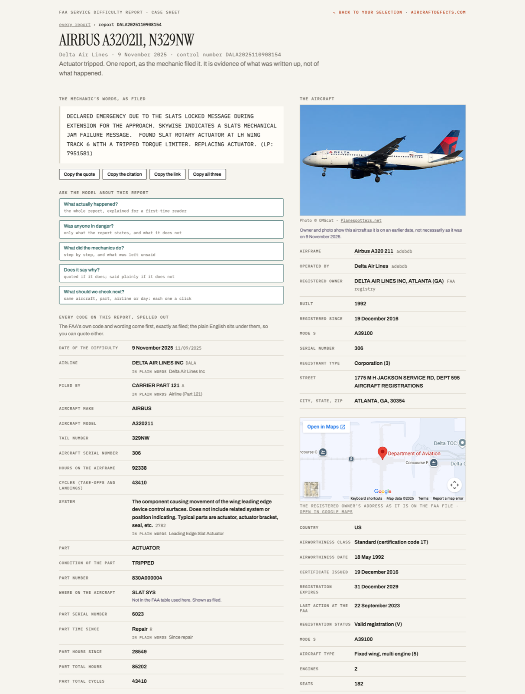

# Five days before the door blew out, a mechanic wrote it down. Only insiders could read it. Now anyone can.

**Live: [aircraftdefects.com](https://aircraftdefects.com/)** · GLM-5.3-Flash, reading the file live · MIT
**Video (83 s, my own voice):** https://www.youtube.com/watch?v=vDMEKsNj7ss · **the build, written up:** [Digital Digging](https://www.digitaldigging.org/p/lets-fix-chaotic-public-data-with)

In the Netflix documentary [*Freefall*](https://www.netflix.com/title/81780118) I watched the father of a crash victim try to read the database of aircraft defect reports kept by the FAA, the US aviation regulator.
It took him hours. With this tool it takes seconds.

Moments after I entered the tool in [Cerebral Valley](https://cerebralvalley.ai/)'s GLM-5.3 Flash hackathon, the [Foundation for Aviation
Safety](https://www.foundationforaviationsafety.org/) wrote to me. Ed, from the
Foundation, after a first look: "It looks impressive. I'm hoping to dig into it
further." They asked for a walkthrough. That is the test of a tool like this:
whether the people who work on the problem every day want to use it.

It is not only for them. Anyone about to board can type a flight number and a
date and read what mechanics wrote about that aircraft, and how often it came
back for the same thing. A journalist gets leads: the same part written up on
several aircraft of one airline on one day, or a box ticked that contradicts
the write-up under it. A researcher gets 1.76 million reports readable at once,
and can ask them questions in plain words.

## Try it in 30 seconds

1. Open [aircraftdefects.com](https://aircraftdefects.com/). The aircraft at the top is shaded by where the trouble sits: the parts written up most are darker.
2. Click a dark part. That zone becomes the selection, in red type, with a counted sentence and the records beneath it, 25 at a time.
3. Click one report. It opens on its own page, `/case/<control number>`, where GLM-5.3-Flash answers five questions: what actually happened, was anyone in danger, what did the mechanics do, does it say why, and what to check next.
4. Or start from the documentary: [#view=freefall](https://aircraftdefects.com/#view=freefall) opens the two reports on N704AL, the aircraft whose door plug blew out.

Free, no login. Any panel marked `model reads` is the model reading the FAA's write-ups live, and every quote is checked against the record before you see it. Counts are counts of reports filed, not of incidents, and the site calculates no safety rates: the point is to find leads, not to rank airlines.

## The file

When an airline, a repair station or another FAA certificate holder in the
United States finds certain kinds of thing wrong with an aircraft, a crack in a
component, rust under a fitting, a failed seal, it is required to report it to
the FAA; other operators may report voluntarily. The write-up is filed by the
organisation, in the words of whoever signed it. Those reports are public: no
sign-in, no fee, no records request. There are **1,758,391** of them, filed
from 1 January 1995 on, on **54,642** aircraft, counted on 2 September 2026.
The newest report in the corpus that day was filed on 31 August 2026;
`/z/api/freshness` prints the current count, the newest report date and when
the corpus was last rebuilt from the FAA's yearly CSVs.

They are also close to unreadable. Almost every answer is a code, and the codes
collide. The FAA files the landing gear as `ZONE 700`. `A` in one column means
the crew made an unscheduled landing, and `A` elsewhere on the same form means
a Part 121 airline filed the report. Emergency descent is a separate code, `B`.

The aircraft from the documentary is in the file. Two reports on N704AL, an
Alaska Airlines 737-9, both filed by the airline. The first, dated 31 December
2023, says a flight attendant reported the forward entry door hard to open; the
aircraft was marked grounded, the door was torque-tested and lubricated, and the
write-up ends with it passing the door system test with no adjustment needed.
That is a different door from the plug, the panel fitted where an unused
emergency exit would be, and the file draws no link between the two. The
second, dated 5 January 2024, is the blow-out in the operator's own words:
rapid decompression at about 16,000 feet climbing out of Portland, emergency
descent, landed twenty minutes after departure. Both open from the red Freefall
cell among the leads, at [#view=freefall](https://aircraftdefects.com/#view=freefall).

*The Freefall view: the documentary's own aircraft, and what was filed about it*

The file is called the Service Difficulty Report, and the FAA publishes it here:

| | |
|---|---|
| the FAA's own search | https://sdrs.faa.gov |
| its query form, the one a family is sent to | https://sdrs.faa.gov/Query.aspx |
| the code tables this site decodes from | https://sdrs.faa.gov/References.aspx |
| what the FAA says the file is | https://sdrs.faa.gov/FAQ.aspx |
| the bulk files this corpus is built from, one CSV a year | https://external.apic4e.faa.gov/sdrs/retrieve/SDR-2025.csv |
| the NTSB's accident file, a different agency and a different record | https://data.ntsb.gov/avdata |

Nothing here replaces that. Every record on this site carries its FAA control
number so you can look it up at the source and check it.

What is not in the file, so you do not go looking for it:

- no accidents and no causes. The NTSB accident file is a different agency's
  record, held separately on this site, and begins in January 2008.
- no fleet sizes and no fleet flying hours, so no rates. The file does carry
  the airframe's own hours on most records (79% of them, see
  [`docs/FINDINGS.md`](docs/FINDINGS.md), F3), but only for aircraft that had
  something filed, so a denominator built from this file would be built out of
  its own numerator. The hours are good for one thing: the interval between
  two write-ups on the same airframe, which "The paperwork gap" and "Old
  airframes" among the leads use.
- a location for most reports: most write-ups describe the place in words and
  carry no zone code, and the page prints how many it could not place.
- current airline names: operators are decoded from the FAA's December 2006
  designator cross-reference and can be stale. Check ownership before publishing.
- who flies the aircraft: the registry is a separate daily FAA file, and the
  registered owner may be a bank or a trustee.
- a census of contradictions: the ledger at [/conflicts/](https://aircraftdefects.com/conflicts/)
  holds rows marked SCAN from a two-pass sweep of 2025 and 2026 only
  (`build/scan_conflicts.py`) and rows marked READING noticed when somebody
  opened a report. Earlier years have not been swept, and no row has been
  checked by a human. Few have swept the file for these before, so the ledger
  grows each time somebody looks.

## What the model does

**GLM-5.3-Flash reads the mechanic's own words, not the codes.** Click one
report and it says in plain English what happened, whether anyone was in
danger, what the mechanics did and what to check next. Pick an airline, a
numbered part of the aircraft, a month or a single aircraft by its tail number,
the registration it carries, and it reads up to 300 write-ups at once. It names
what keeps coming back, what the crew did, one aircraft's life from first
report to last, two airlines side by side, and where the box a filer ticked
disagrees with the sentence beneath it. Ask in plain words and it turns the
question into a search.

**Fifteen places in this service call GLM-5.3-Flash to read the FAA's raw
write-ups at the moment you click.** Count them yourself: every route in
`app/app.py` whose body reaches the model. Ten of them stream, so the reading
appears a sentence at a time. The panels that do it carry a `model reads`
badge, so you always know which words are the file's and which are the
model's. Thirteen of them are below.

| | what the model does, live |
|---|---|
| **the front page** | the newest report where the crew had to act, already read: the whole record decoded, told in about a hundred words, ending with what the report does not say. Pre-read the moment it arrived, on screen in under a second |
| **any report** | five questions on its own page: what actually happened, was anyone in danger, what did the mechanics do, does it say why, and what to check next, which comes back as searches you can click |
| **what recurs here** | reads up to 300 write-ups on your selection and names what keeps coming back that no coded field was built to hold |
| **code vs words** | finds reports where the box a filer ticked disagrees with the sentence they wrote underneath it. Two passes must agree before it is shown |
| **where the words say it happened** | many reports describe a location in prose and carry no zone code. The model places them, and keeps a location only when it can quote the words back verbatim |
| **any word in a write-up** | what mechanics mean by it, drawn from the write-ups that carry it |
| **one aircraft, end to end** | its life oldest first, one turning point at a time, each pinned to its record |
| **compare** | the newest 150 write-ups from each of two airlines: shared, only here, only there |
| **the Freefall page** | the file's own reports on the door-plug fleet, and beneath them, labelled the web and not the file, what the NTSB found |
| **the web, on any report** | the server searches the web first and the model summarises only the results, pointed at one record: tail, airline, type and date. What the world wrote, in a separate box that says it is not the file |
| **the FAA registry file** | "Make this file readable": what the registry says about one aircraft and what it does not, in 140 words |
| **before you export** | reads the reports your filters selected and says which of them do not belong to what you seem to have meant, quoting the words and the record number, and what the filters will miss |
| **a question with no field** | ask it something the form cannot hold, "what plane is the most dangerous", and it says first what the file cannot tell you, then drafts filter chips checked against the FAA's own code tables and airline list |

*Seventeen ways into the file. The two marked `model reads` are the model's own*

How each quote is checked is under [Prove it](#prove-it) below.

## What the page does

One screen. Four rails that are always there, WHERE, WHEN, WHO, WHAT IT
FORCED, and a breadcrumb; a search line that takes a question or a word, a
tail number, an airline, a type, with real suggestions for each; and a period
line.

At the top sits a schematic aircraft, seen from the side. The parts that get
written up most are drawn darker. The parts nobody reports are pale. You land
on the page and before you have read a word you already know which section of
the aircraft is in trouble. It can only place a report that used a numbered
zone; in most reports the mechanic simply wrote where it was, in plain
English, and in some there is no location at all. A machine asked to draw
where aeroplanes break will draw it from whatever it can place, and the result
looks complete. It will not volunteer the gap, because it has no instinct for
the sentence beginning "this cannot show you". So the number of reports placed
by prose only, and the number with no location at all, sit underneath the
aircraft in the same size type as everything else.

Click anything and it becomes the selection: a zone, a month, an airline, a
crew action, a system, a word. The chosen thing appears in big red type above
the findings, then a counted sentence, then the records, 25 at a time through
the whole selection, airlines named rather than coded. Every report opens on
its own page, `/case/<control number>`: the write-up with copy-the-quote and
copy-the-citation buttons, every code spelled out with the FAA's wording kept
beside the plain English, "before you publish this" caveats, links to the
FAA's own search, FlightAware, Flightradar24 and the registry for the tail,
and the way back to the selection it came from.

Seventeen leads under the fold each become the main screen when clicked. There
is always a way back: the breadcrumb, the × on every filter, "clear all, back
to the start".

*The page: four rails, the aircraft shaded by where the trouble sits, and the leads beneath*

### Ten minutes, one lead

The lead built for a reporter is "Same day, many aircraft": one operator, one
system, several tails, one date. Open it directly at
[#view=clusters](https://aircraftdefects.com/#view=clusters). It is a table,
newest first, of every day on which one airline wrote up the same system on
three or more aircraft: date, airline, system, reports, aircraft, an example
part, and "looks routine" where the file suggests a scheduled inspection rather
than a fault. Nothing in that table is the model's; it is arithmetic over the
records.

Click a date and the whole page narrows to that day. Click "What recurs here"
and the model reads up to 300 of those write-ups and says what keeps coming
back, one quote per paragraph with its record number, and the page prints
"N quotes checked, N verified". Click any row and the report opens on its own
page with copy-the-quote and copy-the-citation buttons and a link to the same
record at sdrs.faa.gov. That is the whole loop: the file finds the day, the
model reads it, the FAA's own site confirms it.

To see what one record looks like before you start, open the documentary's own
report at [/case/ASAA2024010547162](https://aircraftdefects.com/case/ASAA2024010547162):
the door-plug blow-out on N704AL, in the operator's words ("AT APPROXIMATELY
16,000 FT DURING CLIMB OUT OF PDX THE AIRCRAFT EXPERIENCED A RAPID
DECOMPRESSION"), with `ZONE 800` and crew codes `B, A` spelled out beside it
as emergency descent and unscheduled landing.

## Why the reading matters more than the counting

A counter can tell you how much. It cannot tell you what happened. The story
of every report sits in a single free-text field, the mechanic's own write-up,
in trade shorthand, in capitals: `R & R NLG UPLOCK BOX IAW AMM 32-33-07`,
which is "removed and replaced the nose landing gear uplock box in accordance
with the maintenance manual". Reading those is the point, so the model's job
changed. Until then GLM-5.3-Flash had been the builder: describe a page, it
writes the code. Now it is inside the page. Every `model reads` panel is the
model reading write-ups at the moment you click.

*The newest crew-action report, told in plain English, with the mechanic's words beneath it*

### Prove it

Every quote the model makes is checked by the server against the record it
cites, with a substring test in ordinary code rather than a second model: are
these words literally in that report? A sentence whose quote fails the check is
deleted before you ever see it, and the page prints the score: "32 quotes
checked, 32 verified". Click any sentence and it opens the records that
sentence stands on.

Be clear about what that score covers. A quote is text inside quotation marks,
or the mechanic's capitals directly before a `[record]` tag, three words or
longer. Only those are tested. A sentence that paraphrases a write-up, or
states a count in prose, is shown with the records it cites so you can read
them, but the server has not confirmed the paraphrase. Treat the verified
quote as the citable unit and everything around it as the model's reading.
Code: `verify_text()` in [`app/app.py`](app/app.py).

*One zone chosen: the count, then the records behind it*

When an answer ends, the model proposes three narrower slices worth opening;
the server looks each one up first and prints the real count, and a suggestion
that matches zero reports is dropped. The model proposes and the file counts,
and that division runs through everything here.

*Reports where the box the mechanic ticked disagrees with the paragraph underneath it*

### How it was built, in one paragraph each

**Every button is one written instruction.** Not code but a description of the
job, with house rules attached: say what you read and how much of it, quote in
the mechanic's own capitals with the record number, say "several" rather than
a number you have not verified, and if the write-ups do not support an answer,
say exactly that in one sentence and stop. The refusal is displayed as a
result.

**The honesty comes from boring code.** The quote checker is a substring test.
The next-click counts are lookups. The date fix is a lookup too: the model read
`01/05/2024` as the first of May, because the FAA writes month first, so now
every date reaches it spelled out as "5 January 2024" and it cannot flip one
again.

**And the loop never went away.** You describe what you want, you look at what
came back, you find the specific thing that is wrong and you say that, and
only that. The model reached for WN, Southwest's airline code from timetables
and tickets, which the FAA file never uses; the file's operator designator is
SWAA, so now the model is handed the real list and nothing outside it is
accepted. Long reports silently broke one of the five questions; the error
turned out to be a web server rejecting long requests, a limit from 1998,
raised in one line. Asked cold about the documentary, the model insisted it was
*Downfall* (2022); now the server searches first and the model is held to the
results. The good parts of this site were not designed in advance. They exist
because I used the thing, found it irritating, and complained precisely.

*One report on its own page, built for citing: the FAA's wording beside the plain English*

### Send out a team

For the parts where I did not yet know how the information should look, I
asked the model for a team of agents: usability, layout and narrative
specialists and a red team, each taking the part of the problem that belongs
to their trade, a project leader choosing between them. They proposed the leads
a journalist would chase, the report from yesterday on the front page, the code
legend in view, and the same-day clusters. The red team also cut things, with
reasons recorded in [`docs/DESIGN-Z2.md`](docs/DESIGN-Z2.md): no chat window
over the selection, no damage map across aircraft types, no event detection by
two model passes agreeing. I did not think of most of what shipped.

## What it refuses to say

The guards are in the prompts and in code, not in the model's judgement. They
are listed per call in [`MODEL_USE.md`](MODEL_USE.md); in short:

- "What recurs here" abstains when a selection has fewer than 12 write-ups,
  and "How the trade says it" under 10 uses of the word. The refusal is shown
  as the result.
- The words because, caused, led to and due to are forbidden in the airframe
  history, and a gap of more than a year in one aircraft's file is printed as a
  gap, never bridged. The file records no causes.
- "Compare" is told never to say one airline is safer or worse. The open
  question is told never to answer "most dangerous", and to say first what the
  file cannot tell you.
- "Ask the file" may only propose codes that exist in the FAA's own tables and
  operators on its own list; anything outside is dropped and listed.
- Every suggested next slice is counted by the server first; a slice with zero
  reports is dropped.
- "Code vs words" posts nothing unless two independent passes name the same
  field.
- Every date reaches the model spelled out, because it once read `01/05/2024`
  as the first of May.

The strongest objection to building this is that the tool can be accurate and
still misleading. Sort by operator and the biggest airline comes out on top,
because it has more aircraft, flying more hours, inspected by more people. A
rigorous maintenance department files more reports than a sloppy one, since
filing the report is the system working. The FAA file contains no fleet sizes
and no fleet flying hours, so this site has no rates and no league table of
airlines, and says in the margin that counts are counts of reports filed, not
of flights.

One pattern survives all of that, and it is why the tool exists: when a single
operator writes up the same system, on several different aircraft, on the same
day, that is a lead worth checking rather than a finding. The file records the
cluster, not its cause. It may be a batch of parts, a supplier, a procedure, a
fleet-wide inspection everybody ran at once, or simply the day the airline's
paperwork went out. You cannot see the cluster reading one row at a time. It
is arithmetic, and a computer should be doing it for you.

## Why it costs almost nothing to run

GLM-5.3-Flash's calls for the whole build, read from the z.ai console, cost
**$1.07**. The coding assistant that wrote the frame around it is not in that
figure (see "Who wrote what"). Public-interest tools usually die at the funding
stage, not the idea stage. At a dollar a project, a researcher with a public
dataset and a free weekend can ship the interface the agency never built. The
data was always public. What fell is the cost of making it usable.

The dollar is low because the model is cheap and because the site pays for a
piece of work once and then never pays for it again. Everything a reader lands
on has already been written. The front page reading is stored under its record
number and kept. The news readings are redone once a day by a scheduled job,
not by whoever arrives first. The airline comparison is rebuilt on a timer
before its six-hour copy runs out, so nobody waits for it. Aircraft panels are
kept for a week. Each code explanation is written once and kept.

The whole public site currently runs on 152 stored readings: 62 pre-read
reports, 77 aircraft, 8 code explanations, 3 comparisons, 2 news topics. That
is the entire model output behind every page anyone has looked at. The model is
called only when somebody asks for something new: a question the form cannot
hold, a report nobody has opened, two airlines nobody has put side by side.
Those calls cost. Reading the site does not.

Measured cost of the reading: 2 to 9 seconds for one report; about 30 seconds
and 260k tokens for 300 write-ups; the whole file would be 1.52 billion
tokens, which is why it is not read whole and
[`MODEL_USE.md`](MODEL_USE.md) says so.

## Who wrote what

**Before it read a single report, GLM-5.3-Flash built a complete working
version of this site on its own.** From 12,241 words of written specifications
and 52 briefs, with no code handed to it, it wrote a page of 594,000 characters
in two days: four rails, an aircraft shaded by where the trouble sits, nineteen
filters, the record table, a case sheet, a phone layout and nine research
features it chose itself. The specifications are in
[`rebuild/specs/`](rebuild/specs/). Every brief it was given is in
[`rebuild/*.prompt.txt`](rebuild/), verbatim. Its reasoning, 4.1 million
characters, is committed beside them. That page still runs at
[aircraftdefects.com/z/rebuilt](https://aircraftdefects.com/z/rebuilt), so use
it rather than take the claim.

**Then the job changed**, and the model moved inside the page: fifteen
endpoints where it reads the FAA's own words live, each one listed in
[`MODEL_USE.md`](MODEL_USE.md) with its guard and its measured cost. The frame
around those readings, the page at the root, was not written by GLM-5.3-Flash.

By character count of everything this repository serves, **68.2% is the model's
and 31.8% is not**, counted by
[`build/count_provenance.py`](build/count_provenance.py). Run it with `--check`
and it fails if the table has drifted.

**The other contributor.** GitHub lists two authors. A coding assistant, Claude
Code, directed by me, wrote the 31.8% that is not GLM's: the frame at the root
that holds the model's readings, the build and splice scripts, the browser
harnesses that measure the page, the deployment plumbing, and this
documentation. It also wrote the guards around the model, the substring check
that verifies every quote and the rules that make it abstain. It reads nothing
for a visitor and appears nowhere on the page. Every word a reader sees is
either the FAA's or GLM-5.3-Flash's. The split is marked in the source: blocks
headed `# ---- hand-written` in [`app/app.py`](app/app.py), and the
file-by-file count in [`MODEL_USE.md`](MODEL_USE.md).

## Running it

This repository is the reading layer, not the file. `app/app.py` answers every
count, search, cluster and case lookup by proxying to a parent service at
`SDR_API` (default `http://127.0.0.1:8124`), which holds the 1.76 million rows
loaded from the FAA's yearly CSVs at
`https://external.apic4e.faa.gov/sdrs/retrieve/SDR-<year>.csv`. That service
and its loader are not in this repository; without it every `/z/api/` route
fails and `/z/api/health` reports `sdr_reachable: false`. The two SQLite files
built here are the NTSB file (`app/build_ntsb.py`, needs mdbtools) and the
registry (`app/build_registry.py`). `requirements.txt` lists flask, requests
and python-dotenv; the run line below also needs gunicorn, and the scripts in
`build/` need certifi. `bash build/check.sh` runs the seven gates described in
[`CONTRIBUTING.md`](CONTRIBUTING.md).

    export ZAI_API_KEY=...

    # --limit-request-line 32768 is not optional: the case-sheet questions carry
    # the whole record in the URL, and gunicorn's default 4094 rejected long
    # write-ups (found 31 August 2026)
    cd app && python3 -m gunicorn -w 2 -b 127.0.0.1:8211 --timeout 300 \
        --limit-request-line 32768 --limit-request-field_size 32768 app:app

    python3 build/count_provenance.py --check   # fails if the provenance table has drifted

## What is in here

| | |
|---|---|
| `rebuild/z2.html`, `rebuild/case.html` | the page and the case page |
| `app/app.py` | the service: the file's API, the model calls, the verifier |
| `rebuild/specs/`, `rebuild/*.prompt.txt` | the specifications and briefs the model was given for the earlier page |
| `MODEL_USE.md` | every live call, its guard and its cost; the provenance count |
| `docs/DESIGN-Z2.md` | the design panel and the red team's cuts |
| `docs/FINDINGS.md`, `HACKATHON_LOG.md` | the working notebook, prompt by prompt |
| `build/` | the browser harnesses and the provenance counter |
| `video/` | the video pipeline: captured page states and frame-exact slides. The earlier cuts used a synthesised narration and are not published; the video linked above is narrated by me |

MIT. The data is the FAA's, published by it at https://sdrs.faa.gov under its
own terms. Codes are decoded from the FAA's own lookup tables; airline names
come from its December 2006 cross-reference and can be stale, so check current
ownership before publishing.

Inspired by Rory Kennedy's [*Freefall: A Reckoning for Boeing*](https://www.netflix.com/title/81780118). Built by Henk van Ess, 2026.
